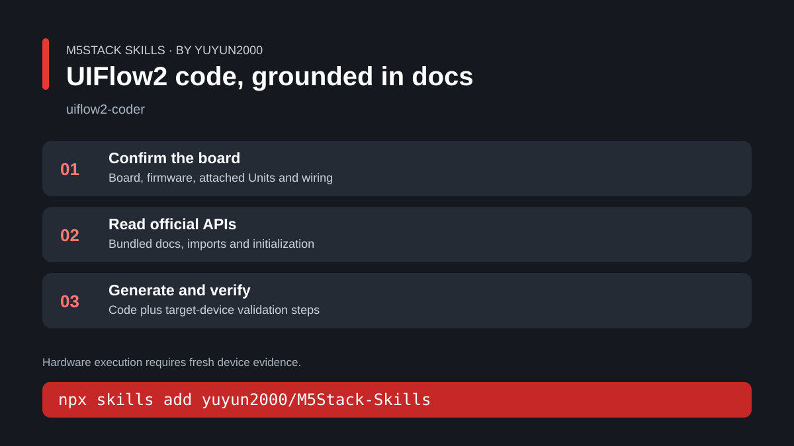
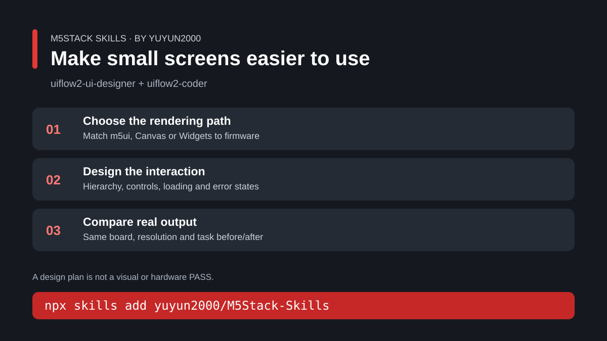
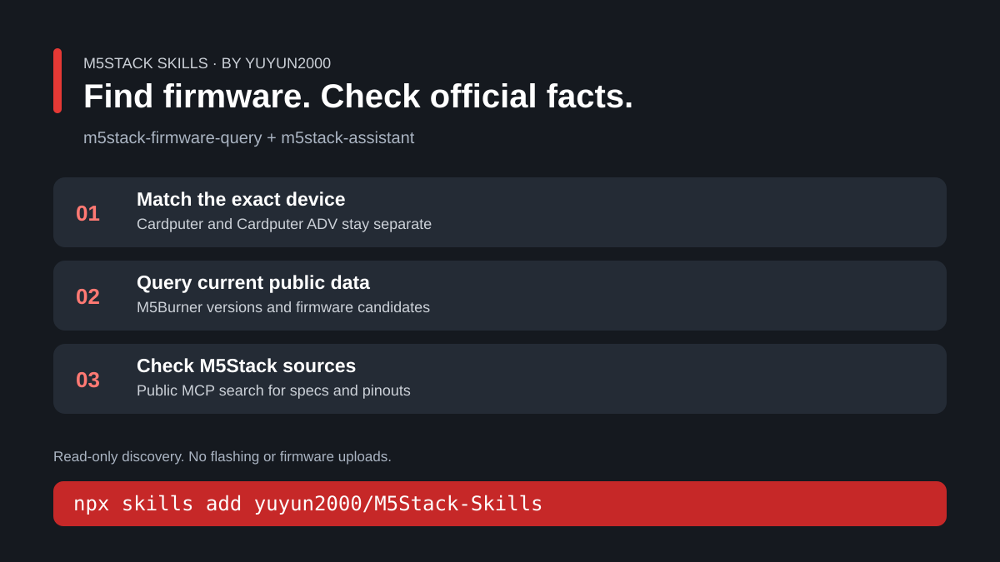

# Launch kit

Publisher: **yuyun2000**. The announcements below describe the released skill
packages. The recording outlines are production scripts, not claims that a
hardware demo has already been filmed.

## Shareable guide cards

These editable SVG cards explain the workflows; they are not hardware screenshots.







PNG exports of the same cards are included in the release launch-kit ZIP.

## English community announcement

**Title: M5Stack Skills: UIFlow2 coding, embedded UI design and firmware discovery for AI agents**

I've published four M5Stack-focused agent skills in one public repository:

- **uiflow2-coder** helps write and debug UIFlow2 MicroPython using bundled
  official API documentation and curated examples.
- **uiflow2-ui-designer** guides screen layout, interaction, animation and
  rendering choices, with the coder skill alongside it for API checks.
- **m5stack-firmware-query** searches public M5Burner firmware, device catalogs,
  versions and discovery lists without an API key.
- **m5stack-assistant** uses M5Stack's public MCP for documentation-based product
  support and troubleshooting.

Install in your project:

```bash
npx skills add yuyun2000/M5Stack-Skills
```

For UI work, install both `uiflow2-coder` and `uiflow2-ui-designer`. Configure
M5Stack MCP separately when installing plain skill folders. The plugin bundle
also includes the public SSE server configuration.

Repository and installation guide:
[M5Stack-Skills](https://github.com/yuyun2000/M5Stack-Skills).
[Download ZIP packages](https://github.com/yuyun2000/M5Stack-Skills/releases).

The skills CLI installation was verified against all 401 package files. Seven
firmware-query tests and GitHub CI passed; public firmware discovery and MCP
search were smoke-tested. Generated programs still need validation on your
specific board and firmware.

If you try them, please share your board, firmware version, prompt and a
sanitized error or result in a
[GitHub Issue](https://github.com/yuyun2000/M5Stack-Skills/issues).
I'd especially welcome feedback on missing API references and UI examples.

## 中文社区发布稿

**标题：给 M5Stack 开发者准备了四个 Agent Skill：UIFlow2 编程、界面设计、固件查询与技术支持**

我把常用的四个 M5Stack Agent Skill 整理成了公开仓库，文档、脚本和示例都放在包里：

- `uiflow2-coder`：先查内置官方 API 文档，再编写和调试 UIFlow2 MicroPython。
- `uiflow2-ui-designer`：处理布局、交互、动画和刷新策略，搭配 coder 核对接口。
- `m5stack-firmware-query`：查询 M5Burner 公开固件、设备和版本，无需 API key。
- `m5stack-assistant`：通过 M5Stack 公开 MCP 查资料、核对产品信息和排查问题。

在项目目录运行即可选择安装：

```bash
npx skills add yuyun2000/M5Stack-Skills
```

做 UI 时请一起安装 coder 和 ui-designer。直接安装 skill 目录时，技术支持 skill 的
MCP 需要另外配置；插件包已附公开 SSE MCP 配置。

[仓库与中文安装说明](https://github.com/yuyun2000/M5Stack-Skills/blob/main/README.zh-CN.md)
｜[完整下载包](https://github.com/yuyun2000/M5Stack-Skills/releases)

目前已验证 CLI 安装后的 401 个文件一致，7 个固件查询测试及 GitHub CI 通过，
公开固件 API 和 MCP 搜索也已做实际查询。生成代码仍需按具体板卡和固件做真机验证。

欢迎试用后反馈产品型号、固件版本、使用需求和已脱敏的结果；缺文档、接口不一致或
示例问题可以直接提 [Issue](https://github.com/yuyun2000/M5Stack-Skills/issues)。

## Demo 1: from a request to UIFlow2 code

**Duration:** 30–45 seconds. **Focus:** `uiflow2-coder`.

| Time | Recording | Narration |
| --- | --- | --- |
| 0–5 s | Show the request and the exact board/firmware. | “让 Agent 写硬件代码，先让它查清楚接口。” |
| 5–15 s | Show the agent reading the relevant bundled docs. | “这个 skill 带了 UIFlow2 官方 API 文档，先核对，再生成。” |
| 15–30 s | Show the generated program and its initialization/update loop. | “代码之外，还会给出这块板上的验证步骤。” |
| 30–45 s | If available, show fresh real-device sensor readings; otherwise show the validation steps with `hardware: NOT RUN`. | “是否跑通，以这次真机结果为准。” |

Prompt:

```text
Use $uiflow2-coder. Target: CoreS3 running my confirmed UIFlow2 firmware,
with ENV III connected to Grove Port A. Read temperature and humidity and
display them. Check the bundled docs for imports, initialization and update
calls. Include a bounded validation procedure and explain firmware assumptions.
```

Before recording: supply the actual firmware version; verify the attached Unit
and wiring. Do not represent a code screenshot as device-execution evidence.

## Demo 2: improve a small-screen dashboard

**Duration:** 30–45 seconds. **Focus:** coder + designer together.

| Time | Recording | Narration |
| --- | --- | --- |
| 0–5 s | Show the same actual screen and data before the change. | “小屏幕最重要的是看清楚、按得到、刷新不闪。” |
| 5–15 s | Show the visual direction and rendering system selection. | “先选布局和渲染路线，再核对控件 API。” |
| 15–30 s | Show the revised page with longest text and error/offline states. | “布局、状态和交互一起检查。” |
| 30–45 s | Side-by-side footage of the same board, rotation and task. | “同一块屏幕，优化前后直接对比。” |

Prompt:

```text
Use $uiflow2-ui-designer with $uiflow2-coder. Improve my supplied 320 x 240
CoreS3 UIFlow2 temperature/humidity dashboard. Keep the existing sensor behavior.
Use documented m5ui controls, clear numeric hierarchy, an offline/error state
and a responsive refresh button. Verify firmware capabilities first.
```

Before recording: use an actual supplied dashboard; capture fresh before/after
footage. Without rendering evidence, label the result `visual: NOT RUN`.

## Demo 3: find firmware and check official information

**Duration:** 30–45 seconds. **Focus:** firmware-query + assistant.

| Time | Recording | Narration |
| --- | --- | --- |
| 0–5 s | Show the exact device variant. | “先分清 Cardputer 和 Cardputer ADV，再查固件。” |
| 5–20 s | Run a bounded public search and show publication/version fields. | “直接查 M5Burner 当前公开数据，不靠旧列表。” |
| 20–35 s | Run official MCP search and show a source-backed result. | “规格和引脚再查官方资料。” |
| 35–45 s | Show the install command and repository. | “四个 skill，按需安装。” |

Commands from the repository root:

```bash
python3 skills/m5stack-firmware-query/scripts/m5stack_firmware_query.py search --device-name "Cardputer ADV" --page-size 5 --format table
node skills/m5stack-assistant/m5-search.mjs "CoreS3 Grove pin definitions" --filter product
```

Record the actual retrieval date and successful output. A firmware listing is
not a compatibility test or an instruction to flash it. Omit session identifiers
and unrelated output from the published recording.
